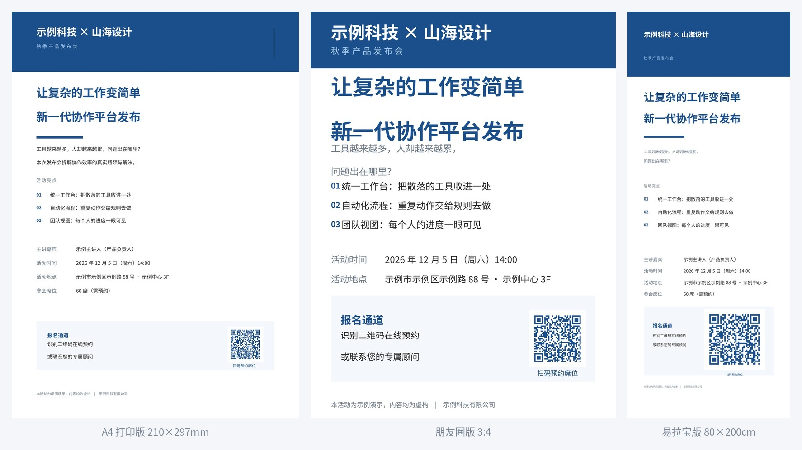

# 嘟嘟海报 · duduhaibao

> 一套数据，一键出 **A4 打印版 / 朋友圈版 / 易拉宝版** 三种格式的活动海报。
> 附**三层护栏**：静默排版 bug 会在编译期大声报错，而不是悄悄印错。



<p align="center">
  <a href="https://github.com/Shine8592/duduhaibao/actions/workflows/ci.yml"></a>
  
  
  
  
</p>

---

## 这是什么

一个**中文优先**的印刷级海报生成工具包。核心不是"又一个海报模板"，而是三件事：

1. **排版引擎直连** —— 用 Typst 编译成 PDF/PNG，不套 MCP、不起服务、不装 Chromium（省 170MB），
   冷启动渲染三种格式 **约 4 秒**。
2. **数据与版式分离** —— 出新稿只改一个 `lib/data.typ`，三种格式同步更新。
3. **护栏体系** —— 排版类 bug 最恶心的地方是**静默**：列宽不够会把 `01` 悄悄裁成 `0`，
   内容溢出页面会被无声切掉，而编译器**一声不吭**。这个项目把它们变成大声报错。

> **零常驻进程、零外部服务、零隐私外传。** 所有渲染在本地完成。

---

## 快速开始

```bash
git clone https://github.com/Shine8592/duduhaibao.git
cd duduhaibao/example

# 依赖：typst + python3/pillow
#   macOS:  brew install typst && pip install pillow
#   Linux:  cargo install typst-cli && pip install pillow

./build.sh              # 三种格式一起出（含预检 + 后检）
```

产物在 `example/out/`：

| 文件 | 尺寸 | 用途 |
|---|---|---|
| `poster-a4.png` / `.pdf` | 2480×3508px（210×297mm @300dpi）| 打印、张贴 |
| `poster-social.png` / `.pdf` | 2160×2880px（3:4）| 朋友圈、手机屏 |
| `poster-banner.png` / `.pdf` | 3150×7874px（80×200cm @100dpi）| 易拉宝、展架 |

**出新稿** —— 只改 `example/lib/data.typ`：

```typst
#let salon = (
  draft:    false,                              // true = 示例数据，preflight 会警告
  org:      "你的机构 × 合作方",
  kicker:   "活动类型",
  title:    "主标题第一行\n主标题第二行",          // \n 手动断行，别靠自动换行
  lead:     "导语第一行……\n导语第二行……",
  highlights: ("亮点一", "亮点二", "亮点三"),
  speaker:  "主讲人",
  date:     "2026年12月5日（周六）14:00",
  venue:    "活动地点",
  seats:    "60 席（需预约）",
  enroll:   "识别二维码在线预约\n或联系您的专属顾问",
  qr_image: "qr.png",                           // none = 显示占位框
)
```

然后 `./build.sh`。**换品牌色**：改 `lib/tokens.typ` 里的 `BRAND` 一个值，三种格式同步跟随。

---

## 三条渲染路线

选错路线会白干一整轮，所以先对表：

| 路线 | 适合 | 做法 |
|---|---|---|
| **Typst** | 文字排版、正式风格、**系列化复用** | `typst compile`，一个静态二进制，PDF 原生 |
| **Pillow** | 照片拼贴、圆角相框、二维码 | 直接 `save()`，见 `references/pillow-page-layout.md` |
| **HTML + WeasyPrint** | 网页感、卡片/栅格布局 | `scripts/render_html_to_png.py`（无需浏览器）|

本仓库的 `example/` 走的是 **Typst 路线**。

---

## 项目结构

```
duduhaibao/
├── SKILL.md                  # 技能定义（可直接放进 Hermes 的 skills/ 目录）
├── references/               # 分路线深度参考
│   ├── typst-route.md        #    Typst 手册 + 完整踩坑清单
│   ├── pillow-page-layout.md #    Pillow A4 几何 / 圆角 / 投影 / 比例裁切
│   ├── cjk-fonts.md          #    中文字体规律、.ttc index 坑、跨平台铁律
│   ├── style-directions.md   #    卡通 vs 正式两套设计 token
│   ├── calendar-and-date-grids.md  # 日历/日期栅格类（风险模型与海报不同）
│   ├── reference-and-ip-matching.md # 按参考图/指定 IP 做设计
│   ├── raster-text-repair.md #    改已有成品图上的错字（不重排）
│   └── publishing-publicly.md#    把客户定制模板开源出去的去标识化流程
├── scripts/
│   ├── preflight.py          # 预检：渲染前查数据 / 渲染后查成品
│   ├── render_html_to_png.py # HTML → PNG/PDF（零浏览器）
│   └── audit_public_release.sh # 公开前的泄漏扫描（发布者自查用）
├── example/                  # 可直接运行的完整示例
│   ├── lib/data.typ          # ★ 唯一真源：只改这里
│   ├── lib/tokens.typ        #   设计 token + 断言护栏
│   ├── templates/            #   三种格式的版式
│   ├── build.sh              #   一键渲染 + 两道闸
│   └── tests/                #   回归测试
│       ├── run_tests.py      #     版式护栏（断言 / 溢出 / 防误报）
│       ├── check_qr.py       #     二维码可扫性
│       └── bug_*.typ         #     故障夹具（每个对应一个真实故障）
├── .github/workflows/ci.yml  # CI：测试 + 渲染 + 上传产物
└── assets/                   # 预览图
```

---

## 一套数据出 N 种格式

月度复用的海报（系列讲座、学期通知）不要每次重建，**建产线**：

```
lib/data.typ      ← 每期只改这一个文件：文案、嘉宾、时间、地点、二维码路径
lib/tokens.typ    ← 颜色、字号阶梯、共用组件（信息行 / 亮点列表 / 品牌带）
templates/*.typ   ← 每种物理规格一个文件，全部 import 上面两个
build.sh          ← 一条命令渲染全部
```

几条经验：

- **数据里不要有版式决策**，但标题文案里的换行要手动写死（自动换行会产生孤字，
  而且文案一改长度断点就变）。
- **二维码做成数据字段**（`none` → 占位框；文件名 → 真图），这样"以后再补二维码"是改一行，
  不是改版式。
- **一种格式 = 一个页面几何 + 一套字号**，不是重新设计。A4、3:4 手机版、易拉宝共用同一批组件。
- 每种格式都要**过一遍物理常识**：A4 留 18mm 页边距；易拉宝最底部约 30cm 会被展架底脚挡住，
  关键信息不能放那儿。
- 验证方式：**改一个数据字段，确认每种格式的产物哈希都变了** —— 这才证明产线真的接通了，
  而不是三份手工维护的副本。

---

## 🛡️ 护栏体系（本项目的重点）

排版失败有两种，**只有一种会发出声音**。Typst 遇到语法错会报错；但内容落到页面外、
或溢出网格单元时，**它会静默裁掉**。两种都要防，而且要防在**拥有该约束的那一层**：

### ① 编译期断言 —— 断言写在知道约束关系的那个函数里

```typst
// lib/tokens.typ：知道「列宽」和「字号」有关系的是这个函数，护栏就该长在这里
#let highlights(items, gap: 2.4mm, num_size: 9pt, txt_size: 10.5pt, label_w: 9mm) = {
  let widest = if items.len() == 0 { "01" } else { num2(items.len()) }
  let need = est_width(widest, num_size)
  if need > label_w {
    _fail("highlights", repr(need), repr(label_w),
          "序号 \"" + widest + "\" 被裁成 \"" + widest.first() + "\"，看着像少了位数字")
  }
  ...
}
```

效果 —— 本来静默的错误变成：

```
error: panicked with: ❌ highlights 空间不够：需要约 57.2pt，只有 25.51pt
   症状：序号 "03" 被裁成 "0"，看着像少了位数字
   修法：加大该组件的 label_w / 缩小字号 / 缩短文案
```

**报错信息写给未来的自己看**：说清症状（`01` 会渲染成 `0`）和修法（加大 `label_w`）。
一句干巴巴的 "assertion failed" 花的时间比省的多。

### ② 两道闸 —— 数据在人手上，成品在像素上

| 闸门 | 时机 | 查什么 |
|---|---|---|
| **闸门 1** | 渲染**前** | `draft` 开关、必填字段为空、`qr_image` 指向的文件是否存在、亮点条数、标题行长 |
| **闸门 2** | 渲染**后** | 尺寸对不对、是不是空白图、**底部净空区是否有内容**（抓静默裁切/溢出）|

```bash
python3 scripts/preflight.py --root .            # 只查数据
python3 scripts/preflight.py --root . --output   # 只查成品
./build.sh all --force                           # 预检报错也强制渲染
```

预检有**错误**会中止渲染（退出码 1）；只有**警告**则继续，但列出待人工确认项。

**"底部净空边带"是最便宜的溢出探测器**：声明一条"必须是空白"的边带，然后断言它真的是白的。
任何被挤到页面外的元素都会落在那里，一次字节遍历就能抓到 —— 不需要模型、不需要 diff。

### ③ 回归测试 —— 一次故障换一个用例，不多不少

```bash
cd example
python3 tests/run_tests.py      # 版式护栏：4/4 通过
python3 tests/check_qr.py       # 二维码可扫性：3 个格式全通过
```

**版式护栏**（`run_tests.py`）：

| 用例 | 对应真实故障 |
|---|---|
| `bug_01_truncated` | 易拉宝序号 `01` 被挤成 `0`（静默，只在成品上可见）|
| `bug_label_wrap` | 朋友圈「活动时间」折成「活动时 / 间」|
| `bug_overflow` | 内容排到页面外被 Typst 静默裁掉 |
| `ok_all` | 三种格式的正确配置（**防断言误报**）|

**二维码可扫性**（`check_qr.py`）：二维码放错位置、尺寸过小、静默区被吃掉、对比度不足，
**屏幕上完全看不出问题，打印出来就是扫不出**。测试让解码器**全图搜索**（不硬编码坐标），
所以它同时能发现"二维码被挪出版面"这类回归；期望值直接从 `data.typ` 指向的源图解码得到，
数据改了测试自动跟随。

护栏必须**两个方向都测**：历史 bug 要"大声报错"，正确配置要"安静通过"。
**会误报的护栏活不过一周** —— 一定会被人删掉。

### ④ CI 自动验证

[`.github/workflows/ci.yml`](.github/workflows/ci.yml) 在每次 push / PR 时：

1. 装 Typst + Noto CJK 字体 + Pillow
2. 跑 `run_tests.py`（版式护栏）
3. 跑 `build.sh`（完整渲染 + 预检双闸）
4. 跑 `check_qr.py`（二维码可扫性）
5. 把 PNG / PDF / 预览图作为 **artifact 上传**，可直接下载查看

**渲染产物不进版本库**（`.gitignore` 里排除了 `example/out/`）——
产物随时可重建，提交它们只会让 diff 变成噪音。要在 CI 里看到成品，
下载 artifact 即可。

---

## 中文字体（跨平台铁律）

**演示电脑以 Windows 为主，其次 macOS/iOS。绝不使用 Linux 专属字体。**

Linux 上渲染用 `Noto Sans CJK SC` 没问题，但**交付给别人的成品/可编辑源文件**里：

- 中文字体用 **微软雅黑（Microsoft YaHei）** —— Windows 全系自带，Mac 装 Office 有，iOS PowerPoint 有
- 英文/数字用 **Arial / Calibri**
- **禁用** 文泉驿微米黑（WenQuanYi Micro Hei）等 Linux 字体 —— Windows/Mac 打开会弹
  「字体不可用」并自动替换，**版式直接崩掉**
- 字体名必须和 `fc-list` 里报的完全一致 —— 写成 `Noto Sans` 会静默回退到拉丁字面，中文全变豆腐块

详见 [`references/cjk-fonts.md`](references/cjk-fonts.md)。

---

## 常见坑（精选）

<details>
<summary><b>Typst 没有 <code>px</code> 单位</b></summary>

单位只有 `pt`/`mm`/`cm`/`in`/`em`/`fr`/`%`。要把 1080×1440 的设计稿搬过来，定义一次换算：

```typst
#let px(v) = v * 0.75pt      // 1 CSS px = 0.75 pt
#set page(width: px(1080), height: px(1440))
```
</details>

<details>
<summary><b>相对路径是相对「调用所在的 .typ 文件」，不是项目根</b></summary>

`lib/tokens.typ` 里写 `image("qr.png")` 会去找 `lib/qr.png`。在 `--root .` 下，
**前导斜杠才是根相对**：

```typst
#let p = if img.starts-with("/") { img } else { "/" + img }
image(p, width: s, height: s)
```
</details>

<details>
<summary><b>模块级 <code>#let</code> 无法被导入方覆盖</b></summary>

Typst 闭包捕获**定义处**作用域。`#import "tokens.typ": *` 之后写 `#let scale = 1.45`
只在本地遮蔽名字，`tokens.typ` 里的函数仍然用原值。**这类值要用参数传，别想覆盖模块全局。**
</details>

<details>
<summary><b><code>leading</code> 属于 <code>par</code>，不属于 <code>text</code></b></summary>

`#set text(leading: 1.9em)` → "unexpected argument"。正确写法：`#set par(leading: 1.9em)`。
</details>

<details>
<summary><b>shell 的 <code>set -e</code> 会吞掉退出码</b></summary>

```bash
check          # ❌ set -e 让脚本在这里就退了，下一行永远执行不到
RC=$?
check || RC=$? # ✅
```
</details>

完整清单见 [`references/typst-route.md`](references/typst-route.md)。

---

## 作为 Hermes 技能使用

`SKILL.md` 就是一个标准的 Hermes 技能定义。装法：

```bash
cp -r duduhaibao ~/.hermes/skills/poster-design
```

之后在对话里说"做个海报"，技能会被自动加载，包含三条路线的选路原则、验证闭环和踩坑清单。

> 不提 MCP 的原因：MCP 的价值只在「多客户端复用」和「重型预热」上成立。
> 海报渲染无状态、Typst 冷启动不到 1 秒、只有一个消费者 ——
> 上 MCP 等于白白多一个会死的进程（实测两个 MCP 常驻 77MB / 6 个进程）。
> 详见 [`SKILL.md`](SKILL.md) 里的架构决策。

---

## 依赖

| 依赖 | 版本 | 装法 |
|---|---|---|
| [Typst](https://typst.app) | ≥ 0.13 | `brew install typst` / `cargo install typst-cli` |
| Python | ≥ 3.9 | 系统自带 |
| [Pillow](https://python-pillow.org) | 任意 | `pip install pillow` |
| Noto Sans CJK | 任意 | `apt install fonts-noto-cjk` / `brew install --cask font-noto-sans-cjk-sc` |

`scripts/render_html_to_png.py` 另有可选依赖：`weasyprint`、`pymupdf`
（以及系统库 `libpango-1.0-0`、`libcairo2`）。

---

## 许可

[MIT](LICENSE) —— 随意使用、修改、商用。

仓库内所有机构名、人名、地址**均为虚构占位**（示例科技 / 示例主讲人 / 示例市示例区），
仅用于演示版式。

---

## English

**duduhaibao** is a Chinese-first, print-ready poster generator. One data file drives
three physical formats (A4 print, 3:4 social, 80×200cm roll-up banner), rendered by Typst
with no browser, no server, and no MCP layer — roughly 4 seconds cold for all three.

Its distinguishing feature is **guarding against silent layout failure**. Typesetting fails
loudly on syntax errors but silently on clipping — a too-narrow grid column renders `01` as
`0`, content pushed past the page edge vanishes, and the compiler says nothing. This project
turns those into hard errors:

- **Compile-time assertions** placed in the helper that owns the constraint (the only code
  that knows a column width and a font size are related), with failure messages that name
  the *symptom* and the *fix*.
- **Two gates**: data validation before rendering (`draft` flag, required fields, referenced
  files existing) and artifact validation after (dimensions, non-blank, and a declared
  bottom-safety strip still white — the cheapest reliable clipping detector).
- **A regression suite** with one fixture per real incident, asserted **both ways**: the
  historical bug must now fail loudly, and valid configurations must still pass. A guard
  that false-positives gets deleted within a week.

See [`SKILL.md`](SKILL.md) for the full method and [`references/typst-route.md`](references/typst-route.md)
for the complete pitfall list.
